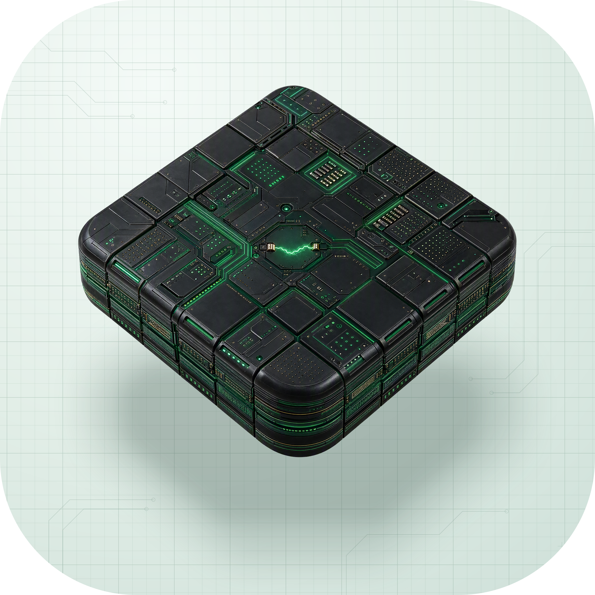

<p align="center">
  
</p>

<h1 align="center">Matrix</h1>

<p align="center">Green-on-black controls, charts, and page templates for dashboards.</p>

<p align="center">
  <a href="https://matrix.hexly.ai">Website</a> ·
  <a href="../README.md">简体中文</a>
</p>

## What it does

Matrix is a React UI example collection inspired by terminal interfaces and the visual style of The Matrix. Green-on-black colors, monospaced text, ASCII borders, and animated characters give its dashboards a shared appearance. Reuse it for an admin interface, personal data page, or product prototype.

The repository runs as a static SPA with mock account, transaction, health, and task data. Login and runtime-status panels demonstrate interfaces; they do not connect to authentication, financial accounts, health data, or a real task scheduler.

## Features

- Compose pages and controls with AsciiBox, MatrixButton, MatrixInput, MatrixSelect, and MatrixShell.
- Explore forms, tables, navigation, overlays, notifications, tags, and confirmation flows.
- Use interface examples for trends, sparklines, yearly heatmaps, metrics, and task-run records.
- Add Canvas character rain, decoding text, typewriter effects, and boot sequences to pages.
- Browse account, card, transaction, budget, portfolio, and Life.ai health-dashboard templates.
- Switch between Chinese and English and inspect the theme palette; the project currently has a single dark theme.

## Usage

Open the [live example](https://matrix.hexly.ai) and explore controls and pages from the sidebar.

| Examples | Routes |
| --- | --- |
| Dashboard and component collection | `/`, `/component-showcase` |
| Controls, buttons, forms, tables | `/controls`, `/buttons`, `/forms`, `/tables` |
| Feedback, overlays, navigation, tags | `/feedback`, `/overlays`, `/navigation`, `/pills` |
| Accounts, cards, transactions, progress | `/accounts`, `/card-showcase`, `/records`, `/progress-tracking` |
| Charts and health examples | `/stats`, `/flow-comparison`, `/portfolio`, `/life-ai` |
| Palette and settings | `/palette`, `/settings` |

Most reusable controls live in [src/components/ui/](../src/components/ui/). Tailwind CSS variables in [src/index.css](../src/index.css) define the theme through classes such as `text-matrix-primary` and `bg-matrix-panel`. Rectangular containers keep square corners; dots and avatars can be circular.

For a business application, replace `src/data/mock.ts` and component-level sample data, then add your own data access and authentication. Example code separates calculations, state, and pages into `models/`, `viewmodels/`, and `pages/`.

## Development

Use Bun. Node.js 24 or newer is recommended.

```bash
git clone https://github.com/nocoo/matrix.git
cd matrix
bun install --frozen-lockfile
bun run dev
```

The development address is `http://localhost:7013`. No backend account or environment variables are required.

```bash
bun run typecheck
bun run lint
bun run build
bun run preview
```

Static output goes to `dist/`. Configure an `index.html` fallback for React Router when deploying. [wrangler.toml](../wrangler.toml) includes Cloudflare Workers static-asset configuration. `/api/live` is a Vite development-server status endpoint and is not provided by the production static site.

## Tests

| Layer | Command |
| --- | --- |
| Unit and component tests | `bun run test` |
| Watch during development | `bun run test:watch` |

Run one test file:

```bash
bun run test src/test/components/MatrixButton.test.tsx
```

Tests use Vitest, jsdom, and Testing Library. Run `bun run test:coverage` for a report on reusable UI components and `src/lib/` utilities. There is currently no separate API or browser end-to-end test entry point.

## Stack


| Area | Implementation |
| --- | --- |
| Application and routing | React, TypeScript, React Router |
| Visuals and charts | Tailwind CSS, native SVG / Canvas, Lucide |
| Localization | i18next, react-i18next |
| Development and hosting | Vite / SWC, Bun, Biome, Vitest, Testing Library, Cloudflare Workers static assets |

## Documentation

- [Brand assets and usage](../assets/brand/README.md)
- [Reusable component source](../src/components/ui/)
- [Changelog](../CHANGELOG.md)

The visual style and some component patterns draw on [VibeUsage's Matrix-A Design System](https://github.com/victorGPT/vibeusage).

## License

[MIT](../LICENSE) © 2026 Zheng Li
